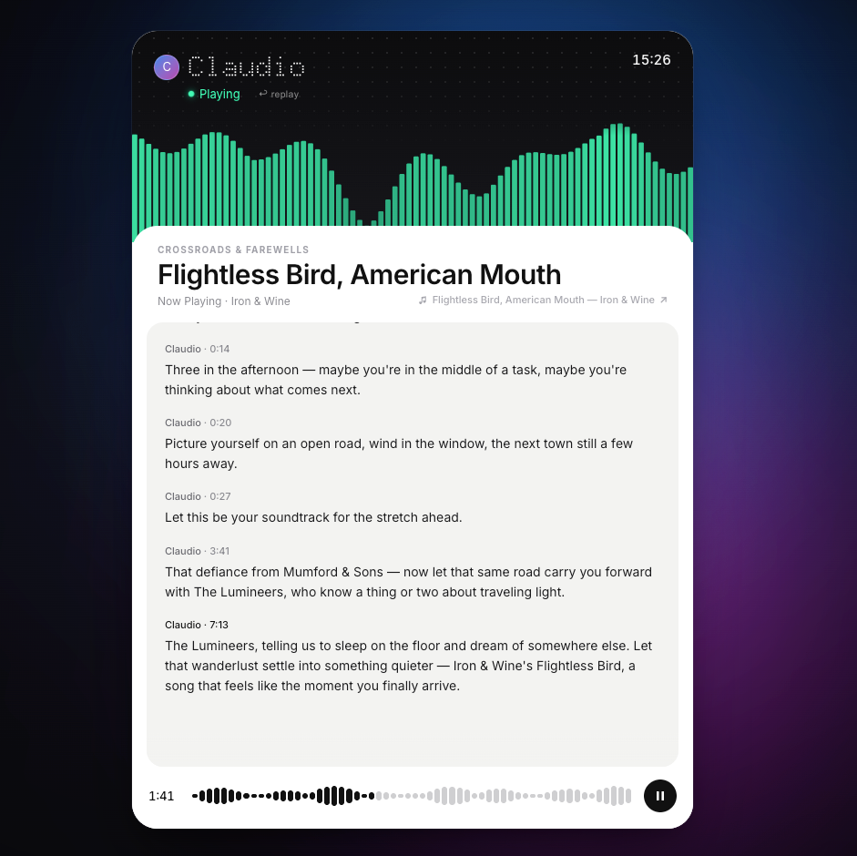

# Claudio FM — AI 私人电台

自动选歌、DJ 开场、歌曲串场，像真实的电台一样运转。



---

## 安装教程（小白版）

> 全程大约需要 10 分钟，只需要操作一次，之后每次打开只需一个命令。

---

### 第一步：安装 Node.js

Node.js 是运行本项目的基础环境，相当于给电脑装一个"运行引擎"。

1. 打开 [https://nodejs.org](https://nodejs.org)
2. 点击左边那个绿色大按钮（写着 LTS 的那个，更稳定）下载安装包
3. 下载完成后双击安装，一路点"继续"和"安装"即可
4. 安装完成后，验证一下是否成功：

**Mac 用户：** 按 `Command + 空格`，搜索"终端"并打开

**Windows 用户：** 按 `Win + R`，输入 `cmd`，回车打开

在终端 / 命令提示符里输入以下命令，按回车：

```
node -v
```

如果看到类似 `v20.x.x` 这样的版本号，说明安装成功 ✅

---

### 第二步：下载项目

**方法一：直接下载压缩包（推荐小白使用）**

1. 打开 [https://github.com/hrhou929/Claudio-FM](https://github.com/hrhou929/Claudio-FM)
2. 点击绿色的 **Code** 按钮
3. 点击 **Download ZIP**
4. 下载完成后，解压到你想放的位置（比如桌面）
5. 解压后你会得到一个叫 `Claudio-FM-main` 的文件夹

**方法二：用 Git 克隆（适合会用命令行的用户）**

```bash
git clone https://github.com/hrhou929/Claudio-FM.git
```

---

### 第三步：打开终端，进入项目文件夹

**Mac 用户：**

1. 打开"终端"（按 `Command + 空格`，搜索"终端"）
2. 把项目文件夹直接**拖进终端窗口**，终端会自动填入路径，按回车

或者手动输入：
```bash
cd ~/Desktop/Claudio-FM-main
```

**Windows 用户：**

1. 打开项目文件夹
2. 在文件夹空白处按住 `Shift`，右键点击
3. 选择"在此处打开 PowerShell 窗口"或"在终端中打开"

---

### 第四步：安装依赖

在终端里输入以下命令，按回车：

```
npm install
```

这会自动下载项目需要的所有组件，大概需要 1–2 分钟，看到光标重新出现就说明完成了 ✅

> 如果出现 `npm : 无法将"npm"项识别为...` 的错误，说明 Node.js 没装好，回到第一步重新安装。

---

### 第五步：生成配置文件

**Mac 用户，在终端输入：**

```bash
cp .env.example .env
```

**Windows 用户，在终端输入：**

```bash
copy .env.example .env
```

按回车，没有报错就说明成功了 ✅

> 配置文件已经填好了所有必要信息，不需要修改任何内容。

---

### 第六步：启动电台

在终端输入：

```
npm start
```

按回车后，终端会开始滚动一些日志。**不用管那些文字，等待大概 30 秒。**

---

### 第七步：扫码登录网易云

启动后，电脑会**自动弹出一个网页**，上面有一个二维码。

用手机打开**网易云音乐 App**，扫描这个二维码。

扫码步骤：
1. 打开网易云音乐 App
2. 点右上角头像
3. 点右上角的扫一扫图标
4. 扫描电脑屏幕上的二维码
5. 在手机上点击确认登录

扫码成功后，盯着**终端**看，出现以下字样说明登录成功 ✅

```
[netease-login] Login succeeded. Cookie saved
```

> 只需要扫码一次，之后每次启动都不需要重新扫码。

---

### 第八步：打开电台

登录成功后，打开浏览器，访问：

**http://localhost:8888**

电台就开始播放了 🎵

---

## 以后每次启动

只需要：

1. 打开终端，进入项目文件夹
2. 输入 `npm start`，回车
3. 打开浏览器访问 `http://localhost:8888`

---

## 常见问题

**Q：终端一直在转，什么时候算启动好了？**

看到 `Claudio FM 启动 → http://localhost:8888` 就启动好了，然后打开浏览器访问即可。

**Q：扫码之后网页没有变化？**

正常的，那个网页是静态的不会刷新。扫码后看终端里有没有 `Login succeeded`，有就是成功了。

**Q：npm install 特别慢？**

可以换成国内镜像再试：
```
npm install --registry=https://registry.npmmirror.com
```

**Q：提示"端口已被占用"？**

等几秒钟，程序会自动处理，或者重新运行 `npm start`。

**Q：关掉终端，电台就停了？**

是的，电台需要终端保持运行。最简化的保持方法：把终端窗口最小化，不要关闭。

---

## 项目来源

Fork 自 [bingyanglu/Claudio-FM](https://github.com/bingyanglu/Claudio-FM)，创意来自博主 **mmguo**。
